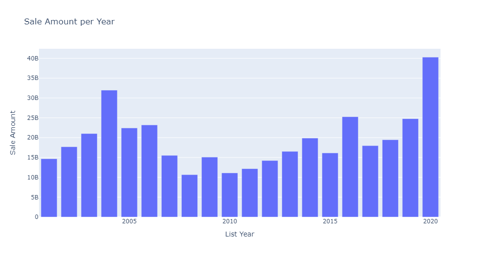
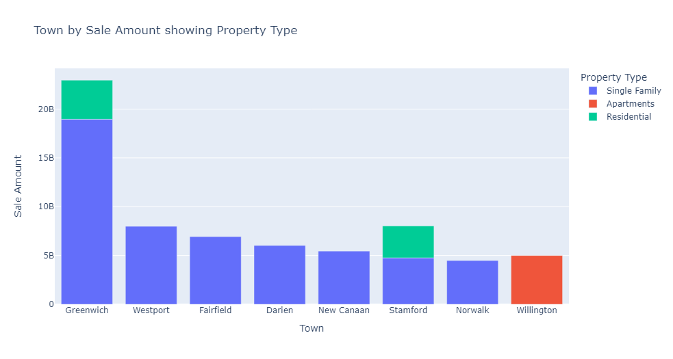

# Real-Estate-Sales-Analysis

## Introduction   
This is a project that makes use of Python Programming Language to analyze Real Estate Sales across different Categories. This analysis will help the business personnels understand the trend of Real estate sales from the year 2000 - 2020 and also help them make data driven decisions concerning their business. Know the town to concentrate on, Know the kind of property type to invet in and so on.

## About the Data
The data was sourced from Kaggle dataset.
It has about 997213 rows and 14 columns.

## Problem Statement
1.	What is the Total Sales of Real Estate per Year?
2.	What is the trend of Real Estate Year on Year (YOY)?
3.	What is the relationship/correlation between assessed Value and Sales Value?
4.	Which property type is the costliest?
5.  Which Town has the highest total sales of Real Estate, and what property type was the most sold? 
6.  Show the Correlation map of the Variables involved.

## Visualization
Each Problem Statement have been answered through using different Visualization methods that can be interpreted and understood even by the layman. The data comes alive through these Visuals
1.	What is the Total Sales of Real Estate per Year?

2. What is the trend of Real Estate Year on Year (YOY)?

3.	What is the relationship/correlation between assessed Value and Sales Value?

4.	Which property type is the costliest?

5. Which Town has the highest total sales of Real Estate, and what property type was the most sold? 

6.  Show the Correlation map of the Variables involved.

## Conclusion
Real Estate will make you cool money if you do it the data driven way. You know the towns to focus on, the property type that sells the most and this helps you to make informed decisions. Use data!

